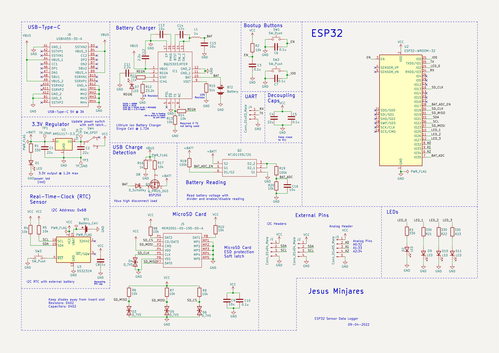

# Hardware

The hardware was developed through [KiCad](https://www.kicad.org) 6.0. 

## **Schematic**

## **Development**
![KiCad](https://img.shields.io/static/v1?label=&message=KiCad%206.0&color=white&logo=data:image/png;base64,iVBORw0KGgoAAAANSUhEUgAAAGwAAAAoCAYAAAAbrx%2B3AAAIUklEQVR42u2aA3RkSxPH%2B2lsI7Zt27aTZ9u2bdu2jeDZWNtGnEl%2FXTlnNbl9J7kzmcx%2BO%2F9z6r3dnb49t%2Fs3XV1d1cgttzjJIEFavQTpkFuurSpfVLjwBPQnvhBhsKUnov9qA1EFcsv1lO%2BJMicuQOMAan%2BzXIAmKgJQEWKVWzyhwr9WrAxpdZZ92iboB0BM1tvF%2BwXaCOWB9QghoRuPlWSamLM8I0%2FCzrT%2FTlFhGrCVp8v2tpPpEq9wE7ISmZTLYXKiSl7AMWWvOsXeOiGPCuzjk9JxdOkrU8AUprTbELPcwGAiYyvecoqV1j6GN5wzfZVtOVeOq%2BoeIm3ePGSA8WXepWJZQDuT8XjKKJcABlZQ8xR%2B%2FrhKvOBMX7zwTB%2F80vFluLj2cfjMTmByJY%2BnDuGJdVECgdwX9mjkwhKpwo4xhx%2BLmUymi7%2BaFdizby7Gfy7YSrWbH%2FqDcfKzW96Hz1ntubcW49T6d22B5ALsCJHUr0LtlfucMbh99fSBHzOq96%2F5Ua5Puo7HU4W73ArjywI4A%2Bs4%2BytM0%2BQkxkVdHzFO8EmX9WI2ffT1apxU8w60dSgwkcy7XB%2FY%2FC9lwIym86n4nC%2F3hKPD4cgVJBR6cgaWUvcupmnN%2BkHGyU2uewcvXLoD0%2FTZd2twQtXb0NaRwPgKj%2BxHYVAczSIQexW4CDAPzsDiK9%2BGlcSo%2F5ZsnzaxcZVv4fc%2BX4lp%2BuH3TTi5lrKyuAMTa30rv7QDFgb3iED%2Fz8D%2BXTwd2MMv%2FIdpWrhsB85sfh%2FaORLY4RrfsvfYYJjCegY1vuWfKT2zn1Z5FbxiCGpasP%2FnWr%2BKL2DfO%2BSAXXnXL5imdRuHcHE3w35nJzCpJvZcNlgKY9pdpJli2pxITen6gMY%2FTcHtaxESGxDoUAJ2MgkyxsctmEk7d43hhlM%2Bh3YOBibRmUK7d1EHZzsrIjtKpIlHM9MREFHySVAjVga2iZUB7SKpTzV5Po58JuCCRSA1ZgqVga1gAok5D44fTgHWdNoXeNfgOGbS6JgFH3fRd6ww4kkAMvDrRjxhmWS0C2%2F%2BkRGYzJBwFTXyC6j7xZ6oD85rIqlvpUyfeC24U%2FLD2El3uUcPq32K3xZITRnIpiRapTnzAeKmdzMcN8bVPiXvQMQ6Z8DAza3fNISZZCEPXnjTjzNaQZfc%2BhOm6SIKMENQ8yLawMTK4HZkh%2BSm5Fs4BC%2BTCkPSVYgiWI3ggm31A%2BDmBNiKNbvwgqXbMU23PfrnjF3eqVf0zQqYQKDwYRnwGGxvdu8jYceMcok4hcqgFqazlTGkYyOH%2FhwHjEWQxZjVHnXK5bMDJlL41LC7Q%2Ful8sx9av%2FVYwhqWQyHbI1vxWfGkM4ttO%2FXBzb%2Bi6yk9i56Az5zSWAff7ManptTYGJt1Jm0QWm8Cl9BDhCPp4%2FU%2BdUMiFShx8LeY51U0fiUfkB7Bz5fE7yvH3UoAKe5UQLhcoSk6j2BCPTrNGDQtO2srwDCnAIjL34FbVBKc9bDyAk6SqSNpbpFuX%2FzvuAo8WqWd33QaWE9TSvW7MZZLe%2FPJ7CHHM2Gx1NGTIX0iqAukTLsRJEq5Hiy8o6jvQN4gD0PkyzMV7R25KgQNu%2FAQN%2F9tB7C9blziZrIs2mDUnkWvIDs12EkrK%2FSeJe8B5mS2e41Um30hXs6MoV2bWJqQ%2F59C3yP04ANDo1jCwvNx19ZOGfAhHK%2FetqgtH7VvcgeiUQmSm6SCzAhZf%2BC4Ohnp2c67n%2F2H9byy%2Fk3%2FjAHwNhrRnAo5V6klKrJ%2BW4x9OMYYBId9YflW%2FGV04FBdv5TUi6haWh4HDee9oXDgYEMwa3LaQODLAWnA7M56362JDIJz9%2BE7IdUG3Ox3Jj5oG1gYj3dE1R9Oy%2B5xLSG96Yy8TStWrcbZ7d%2B4HBgckPSTdSzGLhF2B9mp8PJvrKNMrm9MPnW6asZuEQBzSVCpmbekr8Vx36Ct%2B0YxTT1%2FbIBghCHAoPsAcnjjdAHl3ClrcBCqos5HyGREU1JbKD1tSdPyAEYmyewwHfOW3nlxEt78cQEPQh56rWFDgUGkhuTb4SBsJ%2FJZCpkJQin9xxQNSThuqdYQwXGUI2GTP9MgCk9c5%2Bmln%2FMpPxjJYHEI8dpBcxbHvmD9VANk%2B9AYCCBLqD%2BV1sFTMiCK0wZdytM2Y%2Fq%2FGt%2FsnZTYkVIN6w4ku9bz9QH3BMRCvUp0AZY8WWexSRVtWQmwAjsfLb303gWvES%2Bv0eijjhZ7VX0GslhTjjtigDYu5%2BvZAlCJnDz6V86DNge12gIblthT1QHexe4IoDK2jbsmBFKNp0KDMThmMAJGNy%2FYAsmGIBBEPIuXr1uENO0dsMgLuz88IBnTruyH1MEpRd2YCCBwlsfUP%2BHPZOh9i5%2BE8JwKIHYH9bHXIL2E1QXyOrdYG%2B%2FckPKzazAYDXQZLFM4rz2DxmhXXffb5hNUJbJ3i99ddXdv2Ca7nj8LxowawlhQJRAhGrG0M4tkIDdU%2FHlSZQRxN0ttfUcgCWR3jLGvcmUeS%2FDvhkOkeEM%2B2V0t1AoZQX28ntLoe5FtdseY655HXfRt%2FA5q33y7ZqpSzkQPX7Wu4barvfnDTip5m0KMOZMhUwffxlcFqW5L1JB3g5pJ7hlC6dbptKwVBt7EZm4BdMAh3SskxtSb4VDttor71loY206v7oBhBQKNF1iuT7hUqYfhDG4dTUEURAkqcw5TzL1S%2B6h%2FAHHCxe4qm3%2FRVKKhPDLFkgM2QKxOf8oCBwESq%2FZXR8Q648SGRIh6ADXBoGHgy7bmMn7JIPBPow46GAE5hZJvVwGk%2BOXeAmxy1zELp0CpjSl3uImxHAZX%2BNd9CI5UL7lWlb8MgQEyC23Dkb9DyzRPzoBjvqGAAAAAElFTkSuQmCC&logoWidth=35&logoHeight=40)

## **Author**
* [**Jesus Minjares** :zap:](https://github.com/jminjares4) 
  * Master of Science in Computer Engineering 
 
 

